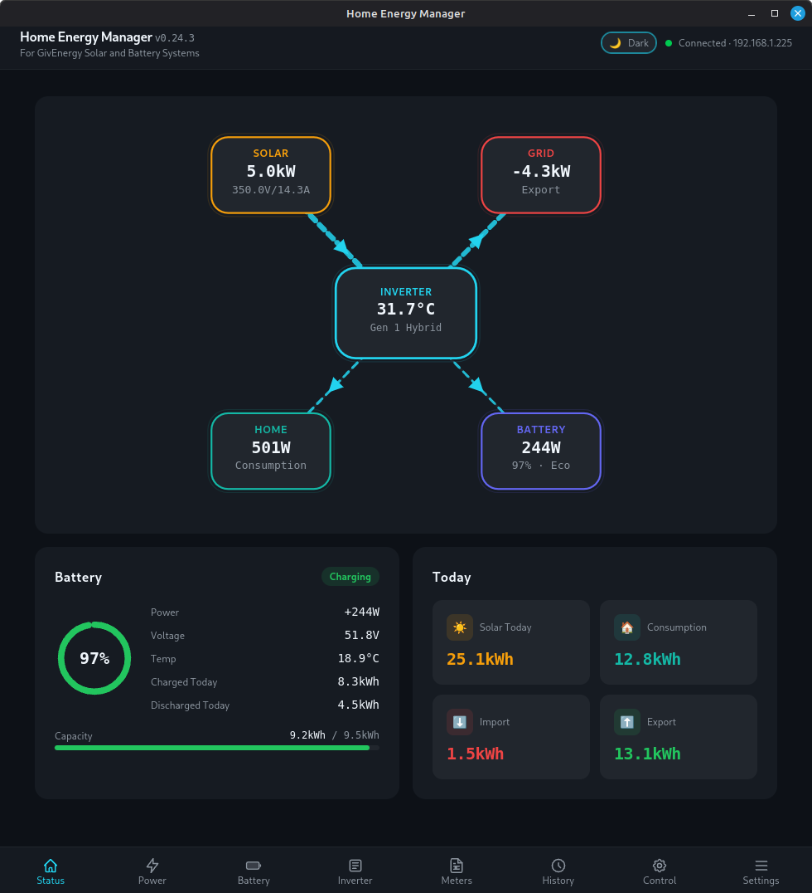
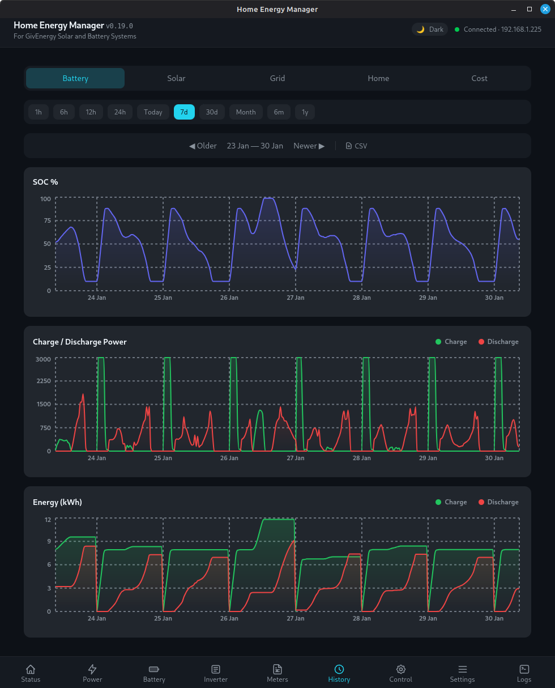
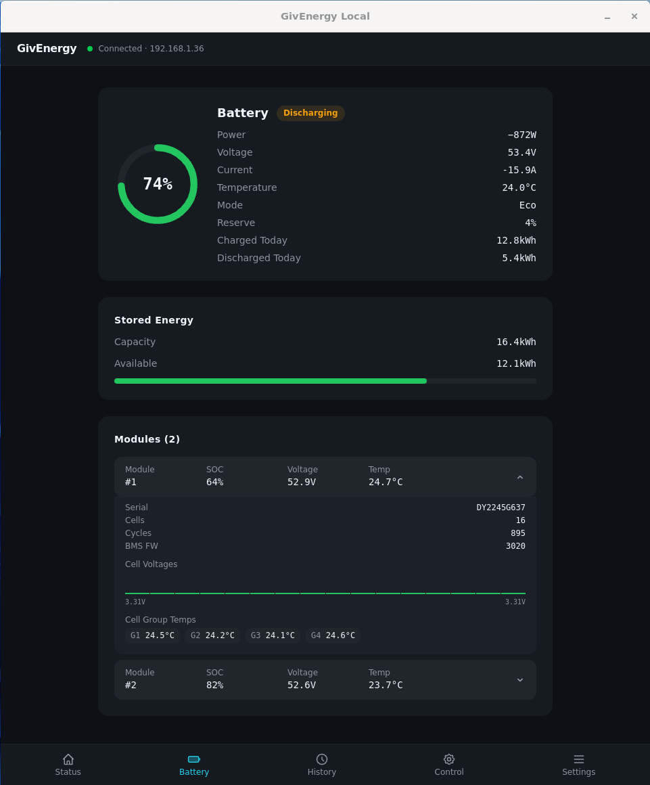
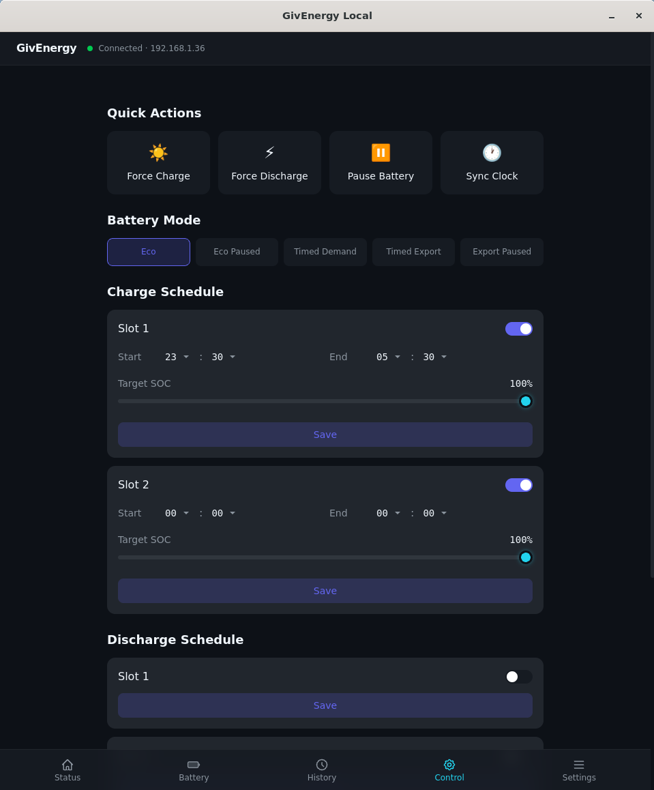
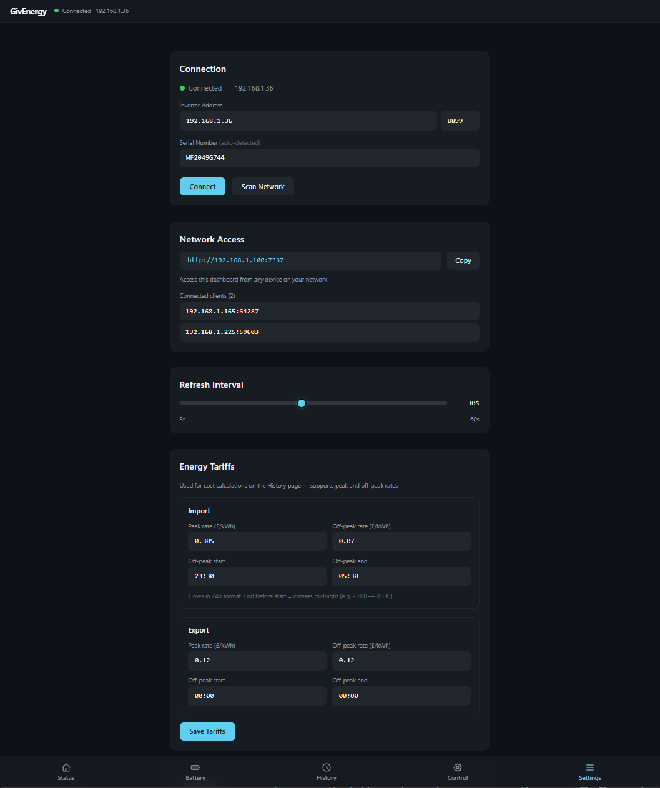
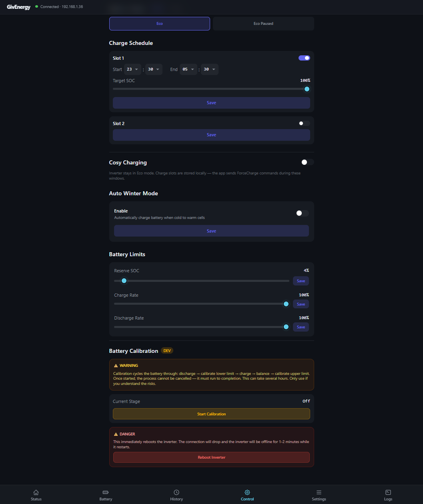

# Home Energy Manager

**Local monitoring and control for GivEnergy solar/battery inverters — no cloud account needed.**


> 🙏 **Huge thanks to the open-source reverse-engineering efforts that made this possible:**  
> [**GivTCP**](https://github.com/GivEnergy/giv_tcp) — the original GivEnergy Modbus integration for Home Assistant  
> [**givenergy-modbus**](https://github.com/dewet22/givenergy-modbus) — detailed register map, protocol reference, and Python library

<div align="center">

<a href="https://www.buymeacoffee.com/psylsph" target="_blank"></a>

</div>

## Important Information about the GivEnergy-Local Renaming

The user-facing name is changing to **Home Energy Manager**. The Linux package/launcher and macOS/Windows app names now use the new name, while the executable remains `givenergy-local` and existing settings/history stay in `~/.givenergy-local` (or `%USERPROFILE%\.givenergy-local` on Windows), so upgrades continue to use the same `settings.json` and `history.db`.

## 🚀 Getting Started

### 1. Download and install

Download the latest release for your platform from the [**Releases page**](https://github.com/psylsph/home-energy-manager/releases/latest):

| Platform | File |
|---|---|
| 🪟 Windows | `.msi` with `x64` or `x86_64` |
| 🍎 macOS (Apple Silicon — M1/M2/M3/M4) | `.dmg` with `aarch64` |
| 🍎 macOS (Intel) | `.dmg` with `x64` or `x86_64` |
| 🐧 Linux (x86_64) | `.deb` with `amd64`, or `.rpm` with `x86_64` |
| 🐧 Linux (ARM64 — Raspberry Pi) | `.deb` with `arm64`/`aarch64`, or `.rpm` with `aarch64` |

**Download note**: Use `.msi` for Windows, `.deb`/`.rpm` for Linux, or `.dmg` for macOS. `.rpm` files are Linux packages, not macOS installers. For Apple Silicon macOS, download the `.dmg` file containing `aarch64`.

**macOS users**: Do NOT drag the app to `/Applications` — macOS blocks unsigned apps there. Drag it to your **Desktop** or **Home folder** instead. On first launch, right-click the app → **Open** → **Open** to bypass Gatekeeper.

#### System Requirements (Linux)

If you're on Linux, install the WebView runtime before running the app:

```bash
sudo apt install libwebkit2gtk-4.1-0 librsvg2-2
```

These are needed by the Tauri desktop framework. The `.deb` package declares them as dependencies going forward, but on older builds you'll need to install them manually.

To uninstall the Linux `.deb` package:

```bash
sudo apt purge home-energy-manager
```

This removes the installed application package, but leaves your user data in `~/.givenergy-local`. To delete settings and recorded history as well:

```bash
rm -rf ~/.givenergy-local
```

⚠️ Deleting `~/.givenergy-local` permanently removes all local history data (`history.db`) as well as settings.

> **Raspberry Pi**: ARM64 builds are available (`*_arm64.deb`). Requires a 64-bit OS (Raspberry Pi OS 64-bit, Ubuntu Server, etc.).

### 2. Find your inverter's IP address

You need the IP address of your inverter's data adapter (the small WiFi or Ethernet dongle connected to your inverter). You can find this in your router's device list — look for a device named "GivEnergy" or check the MAC address printed on the dongle.

The adapter listens on **port 8899**.

### 3. Connect

1. Open the app and go to **Settings** (gear icon ⚙️ in the sidebar)
2. Enter your inverter's IP address in the **Host** field
3. Click **Connect**

The app connects to your inverter over your local network. The serial number is detected automatically. Live data should appear on the Status page within a few seconds.

### 4. (Optional) Can't find the IP? Scan your network

Click **Scan Network** on the Settings page. The app will scan your local network for GivEnergy data adapters and list any it finds. Click on one to auto-fill the IP address.

> **Tip**: If the connection keeps dropping or data looks wrong, try a wired Ethernet connection between your data adapter and router. The WiFi dongles can be unreliable.

## Screenshots

<table>
  <tr>
    <td align="center"><b>Status Dashboard</b><br></td>
    <td align="center"><b>Energy History</b><br></td>
  </tr>
  <tr>
    <td align="center"><b>Battery Detail</b><br></td>
    <td align="center"><b>Control Panel</b><br></td>
  </tr>
  <tr>
    <td align="center"><b>Settings</b><br></td>
    <td align="center"><b>Developer Console</b><br></td>
  </tr>
</table>

## What it does

Home Energy Manager connects directly to your inverter's WiFi or Ethernet data adapter over your home network. It shows you what's happening right now and lets you change settings without needing a GivEnergy Cloud account or portal login.

- **Real-time dashboard** — see solar generation, battery charge level, grid import/export, and home consumption updating live
- **Energy flow diagram** — visual animation showing where power is flowing right now (solar → battery → home → grid)
- **Battery details** — individual cell voltages, temperatures and health per battery module
- **Charge & discharge schedules** — set time slots for when your battery charges from the grid or discharges to power your home (up to **10 slots** on supported models)
- **Battery modes** — Eco, Timed Discharge, and Pause, plus **Force Charge** / **Force Discharge** override buttons for instant manual control
- **SOC control** — adjust battery reserve level, charge/discharge power limits, and charge target
- **Octopus Cosy automation** (beta) — enter your three Cosy cheap-rate windows and the app force-charges the battery through each one, then returns the inverter to Eco mode in between. Survives an app restart mid-slot.
- **Octopus Agile automation** (beta) — enter your postcode to auto-detect your Octopus region, set charge and discharge price thresholds, and the app force-charges when Agile prices are low, force-discharges when they're high, and sits in Eco mode the rest of the time. Includes a live 24-hour price forecast grid.
- **Auto Winter Mode** — a local re-implementation of GivEnergy Cloud's winter mode: force-charges the battery from the grid when its temperature drops, to protect it from the cold. (Note: this is independent of the cloud's winter mode — the inverter has no built-in winter capability, it's entirely cloud/app-driven.)
- **Three-phase, HV and commercial inverters** — full support for the GIV-3HY family, AC three-phase, HV Gen 3, and All-in-One commercial units, reading their 1000-range register layout and writing their native schedule/limit registers
- **Auto-discovery** — just enter your inverter's IP address; the serial number is detected automatically
- **History & cost tracking** — 7 time-range charts for solar, battery, grid, and home energy, plus a month calendar view, with configurable import/export tariffs (peak/off-peak) and CSV export
- **Multi-instance** — run several copies against different inverters, each with its own config directory and HTTP port
- **Headless server mode** — runs as a pure background service on a Raspberry Pi or always-on server, serving the UI over HTTP/WebSocket to any browser on your LAN
- **Developer console** — live log viewer for diagnostics, with adjustable capture level (enable in Settings)

---

## Supported Inverters

Home Energy Manager works with all known GivEnergy inverter models. Real-time
monitoring, manual overrides (Force Charge / Force Discharge), Cosy and Agile
automation, and Auto Winter Mode work on every model. The main difference between
models is **how many charge/discharge schedule slots** you can set, and where
the battery temperature/capacity values come from:

### 10-slot schedules ✅

*Full control: read live data, set up to 10 charge + 10 discharge slots, adjust
limits, change modes, force charge/discharge, Cosy/Agile automation*

| Model | Notes |
|---|---|
| **Gen 3 Hybrid** (5kW/8kW/10kW) | Most common. Extended 10-slot schedules require ARM firmware ≥ 303. |
| **Gen 4 Hybrid** | Latest generation |
| **Three Phase** (e.g. GIV-3HY-11 11kW) | Uses the IR 1000-1413 register layout. Schedules at HR 1113-1121 (slots 1-2) + HR 240-299 (slots 3-10). Battery temp/capacity come from the BMS module read. |
| **AC Three Phase** | Same three-phase register layout |
| **HV Gen 3** | High-voltage hybrid |
| **All-in-One** (3.6kW/5kW/6kW) | Commercial all-in-one units |
| **All-in-One Hybrid** | Combined hybrid + AIO |
| **AIO Commercial** | Commercial three-phase variant |

### 2-slot schedules ✅

*Full control with the simpler 2-slot schedule layout*

| Model | Notes |
|---|---|
| **Gen 2 Hybrid** | Standard home hybrid inverter |
| **Gen 3 Plus Hybrid** / **Polar Hybrid** | Newer single-phase variants |
| **PV Inverter** (no battery) | Solar-only — battery controls hidden |

### 1-slot schedules ✅

*Read live data, change charge/discharge power limits, adjust SOC reserve and
modes — but only a single charge + single discharge slot*

| Model | Notes |
|---|---|
| **Gen 1 Hybrid** | Older generation, 1 charge + 1 discharge slot |
| **AC Coupled** (standard & Mk2) | Retrofit battery system. Charge/discharge limits are 1-100% (not 0-50%). 1 charge + 1 discharge slot. |

> **Not sure which model you have?** Open the app, connect to your inverter,
> and check the Inverter tab — it shows the detected model name and details.
>
> **Slot labelling note**: GivEnergy's cloud portal labels charge slots 1 and 2
> in the opposite order to this app (and to the givenergy-modbus / GivTCP
> reference libraries). The underlying data is identical — only the labels
> differ. A yellow banner in the app flags this where it matters.

## How it works

```
┌─────────────┐                ┌──────────────┐              ┌───────────┐
│  This app   │ ◄── network ──► │  Data adapter │ ◄── serial ──► │ Inverter  │
│  (desktop)  │   port 7337     │  (dongle)     │   port 8899  │ + Battery │
└─────────────┘                 └──────────────┘              └───────────┘
```

The app talks to your inverter's data adapter over your local network using the Modbus TCP protocol. It never connects to the internet or sends data anywhere else.

### Battery SOC

The battery state of charge (SOC) shown on the Status and Battery pages comes
from the inverter's own register (IR 59), which is the same value the official
GivEnergy app and GivTCP report. If this register returns 0 (indicating a
corrupted read), the app falls back to a capacity-weighted average calculated
from all connected battery modules using their `remaining_capacity / capacity`
registers.

For multi-battery systems, each module's individual SOC is shown in the
Battery page module cards. The main SOC display reflects the inverter's
aggregate value.

## Tech Stack

Built with [Tauri 2](https://v2.tauri.app/) (Rust + React), Axum, and TypeScript. See [DESIGN.md](./DESIGN.md) for architecture details and the register map. Planned and under-investigation work is tracked in [ROADMAP.md](./ROADMAP.md).

## Development

```bash
# 1. Install dependencies
npm install
cargo install tauri-cli

# 2. Build the frontend first (creates dist/)
npm run build

# 3. Build and Run the Rust backend
cd src-tauri && cargo tauri dev
```

## Running Headless (Native)

```bash
# 1. Install dependencies
npm install
cargo install tauri-cli

# 2. Build the frontend first (creates dist/)
npm run build

# 3. Build the Rust backend
cd src-tauri && cargo build --release

# 4. Run headless (no GUI window)
nohup ./target/release/givenergy-local --headless > givenergy-local.log 2>&1 &
```

> The frontend (`dist/`) must be built before the Rust binary, otherwise
> the server won't have any UI files to serve. Alternatively, use `--dist`
> to point to an existing build:
>
> ```bash
> ./target/release/givenergy-local --headless --dist /path/to/dist
> ```

## Running Headless (Docker)

```bash
# Build and start with docker compose
docker compose up -d

# Rebuild after code changes
docker compose build && docker compose up -d
```

**Persistent data** (settings + history DB) lives in `${HOME}/.givenergy-local` and
is mounted into the container at `/root/.givenergy-local`. This survives restarts.

## Running on unRAID

Community contributor instructions for running Home Energy Manager as a Docker container on unRAID.

### 1. Create a folder

Open the unRAID terminal (Main UI → top-right >_ Terminal):

```bash
mkdir -p /mnt/user/appdata/givenergy-local
cd /mnt/user/appdata/givenergy-local
```

### 2. Download the project

```bash
git clone https://github.com/psylsph/home-energy-manager.git .
```

### 3. Create a Dockerfile

```bash
nano Dockerfile
```

Paste this:

```dockerfile
FROM node:22-bookworm AS frontend
WORKDIR /app
COPY package*.json ./
RUN npm install
COPY . .
RUN npm run build

FROM rust:latest AS builder
WORKDIR /app
RUN apt-get update && apt-get install -y \
    pkg-config \
    libdbus-1-dev \
    libgtk-3-dev \
    libsoup2.4-dev \
    libjavascriptcoregtk-4.1-dev \
    libwebkit2gtk-4.1-dev \
    libayatana-appindicator3-dev \
    librsvg2-dev \
    && rm -rf /var/lib/apt/lists/*
COPY . .
COPY --from=frontend /app/dist ./dist
WORKDIR /app/src-tauri
RUN cargo build --release

FROM debian:trixie-slim
WORKDIR /app
RUN apt-get update && apt-get install -y \
    ca-certificates \
    libgtk-3-0 \
    libwebkit2gtk-4.1-0 \
    libayatana-appindicator3-1 \
    librsvg2-2 \
    libdbus-1-3 \
    && rm -rf /var/lib/apt/lists/*
COPY --from=builder /app/src-tauri/target/release/givenergy-local /app/givenergy-local
COPY --from=frontend /app/dist /app/dist
EXPOSE 7337
CMD ["/app/givenergy-local", "--headless"]
```

Save with `Ctrl+O` → `Enter` → `Ctrl+X`.

### 4. Build the image

This will take a few minutes on first run.

```bash
docker build --no-cache -t givenergy-local .
```

### 5. Run the container

```bash
docker run -d \
  --name givenergy-local \
  --network host \
  -v /mnt/user/appdata/givenergy-local/data:/root/.givenergy-local \
  --restart unless-stopped \
  givenergy-local
```

Check the logs:

```bash
docker logs -f givenergy-local
```

Visit `http://[YOUR UNRAID IP]:7337` in a browser to verify it's running.

### 6. Add to the unRAID Docker UI

To make the container manageable from the unRAID Docker page, first remove the manually created one:

```bash
docker rm -f givenergy-local
```

Then in the unRAID **Docker** page:

1. Click **Add Container** → select **Advanced Mode**
2. Set **Repository** to `givenergy-local`
3. Set **Icon URL** to `https://avatars.githubusercontent.com/u/84566103?s=200&v=4`
4. Set **Web UI** to `http://[IP]:7337`
5. Set **Network Type** to `Host`
6. Add a **Container Path** of `/root/.givenergy-local`
7. Set the corresponding **Host Path** to `/mnt/user/appdata/givenergy-local/data`

The container will persist data (settings + history) across stop/start cycles. To update, rebuild the image with the latest code and recreate the container.

## Running Multiple Instances

You can run multiple copies of the app to control different inverters. Each instance
needs its own **config directory** and **HTTP port**.

### Step 1: Separate config directory

Set `GIVENERGY_LOCAL_CONFIG_DIR` to a different directory for each instance so they
don't share `settings.json` and `history.db`:

**Linux / macOS:**

```bash
# Default (uses ~/.givenergy-local/)
./givenergy-local

# Second instance with its own config and history
GIVENERGY_LOCAL_CONFIG_DIR=~/givenergy-instance2 ./givenergy-local
```

**Windows (PowerShell):**

```powershell
# Second instance
$env:GIVENERGY_LOCAL_CONFIG_DIR = "C:\Users\You\givenergy-config-2"
.\givenergy-local.exe
```

**Windows (Command Prompt):**

```cmd
set GIVENERGY_LOCAL_CONFIG_DIR=C:\Users\You\givenergy-config-2
givenergy-local.exe
```

### Step 2: Separate HTTP port

Each instance must use a different HTTP port (default 7337).

**Desktop app:** Change the port in **Settings → HTTP Port**, then restart the app.
Alternatively, edit `http_port` directly in the `settings.json` file in the config
directory before launching the second instance:

```json
{
  "http_port": 8080,
  ...
}
```

**Headless server:** Use the `--port` flag:

```bash
GIVENERGY_LOCAL_CONFIG_DIR=~/givenergy-server ./givenergy-local --headless --port 8080
```

**Docker:** Edit `http_port` in the mounted `settings.json`, or use `--port` in the
container command.

If two instances share the same port, the second one will fail to start its web
server and the app window will show a blank page.

See [DESIGN.md](./DESIGN.md) for full build instructions, testing, and architecture documentation.

## Credits

This project would not exist without the pioneering reverse-engineering work of the GivEnergy open-source community.

- **[GivTCP](https://github.com/GivEnergy/giv_tcp)** — The original GivEnergy Modbus integration for Home Assistant. This project established the core Modbus protocol mapping, register addresses, and write methodology that this app builds on. Without GivTCP, none of this would be possible.

- **[givenergy-modbus](https://github.com/dewet22/givenergy-modbus)** — The definitive Python reference library for the GivEnergy Modbus protocol. Its detailed register map, frame format documentation, and working reference implementation were invaluable in getting the protocol right — especially the write protocol (function code 6, device address 0x11) and the HHMM timeslot encoding.

Both projects are open-source and available on GitHub. If you find this app useful, consider giving them a star too ⭐

## License

MIT — see [LICENSE](./LICENSE).
