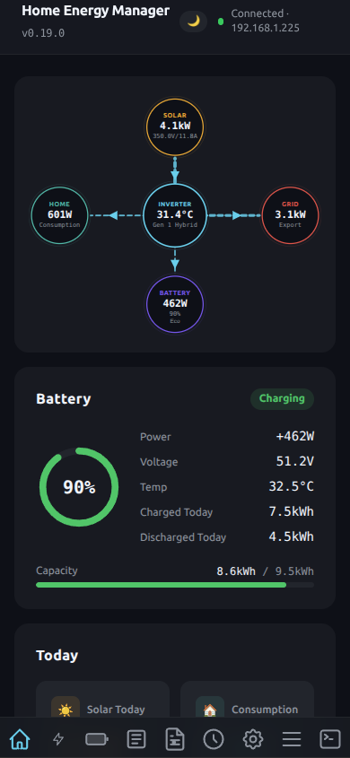
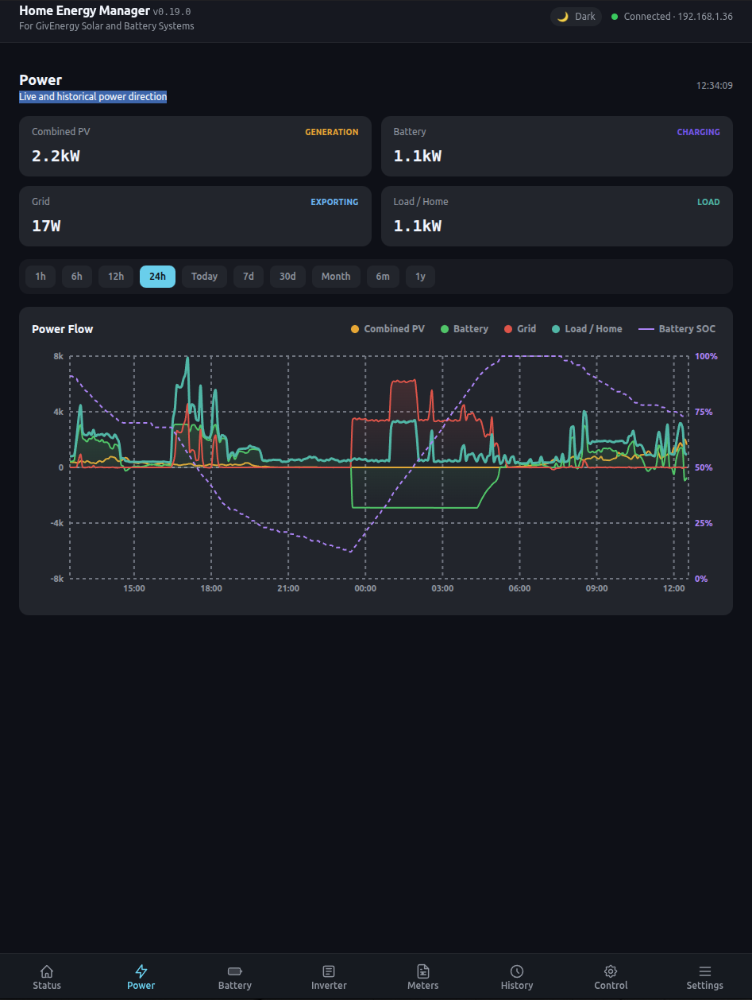
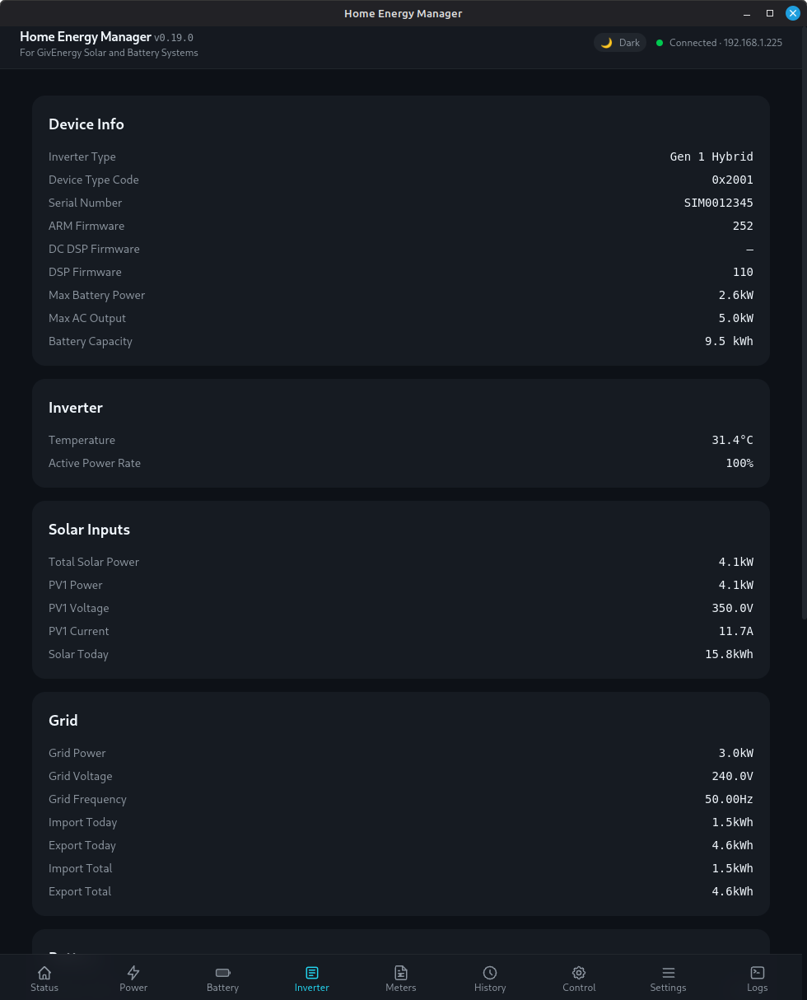
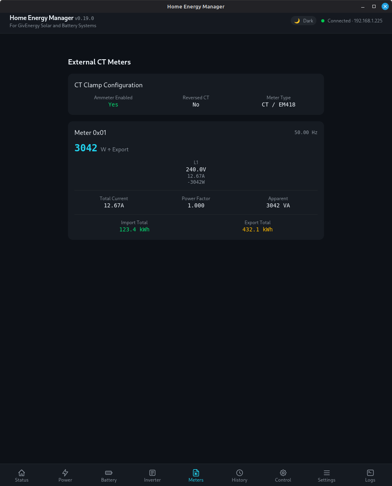
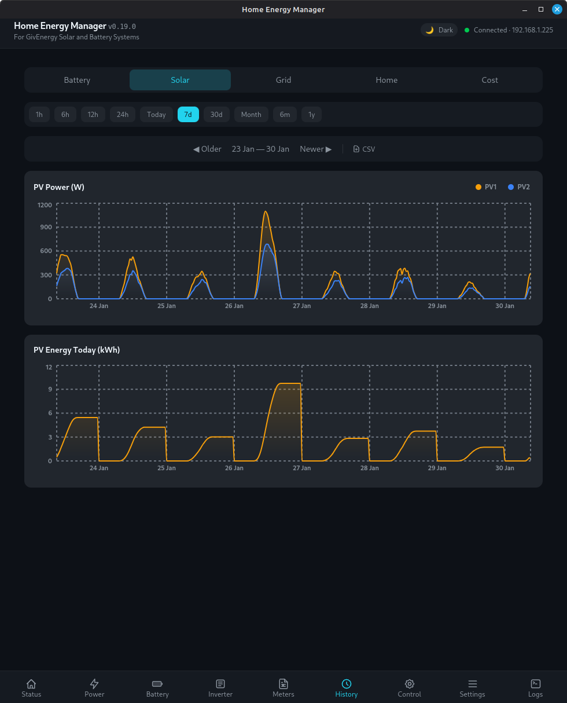
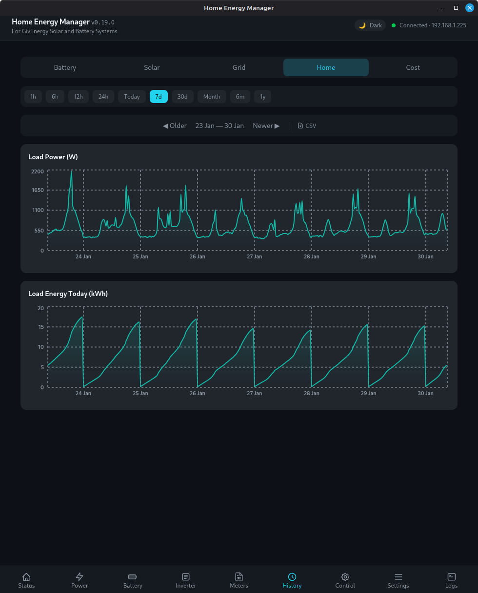
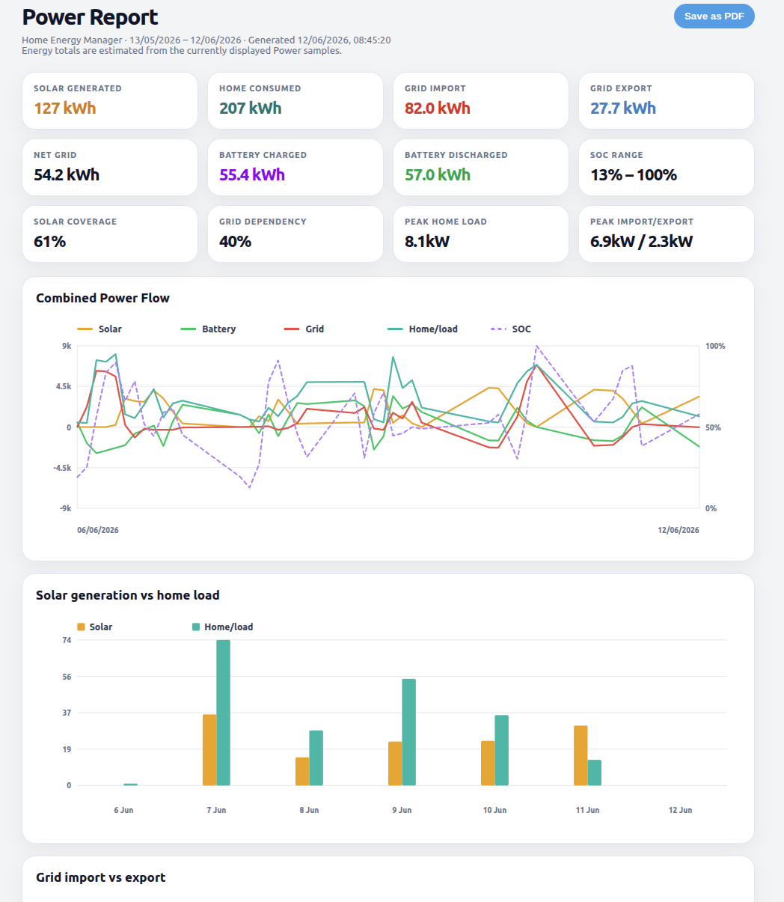
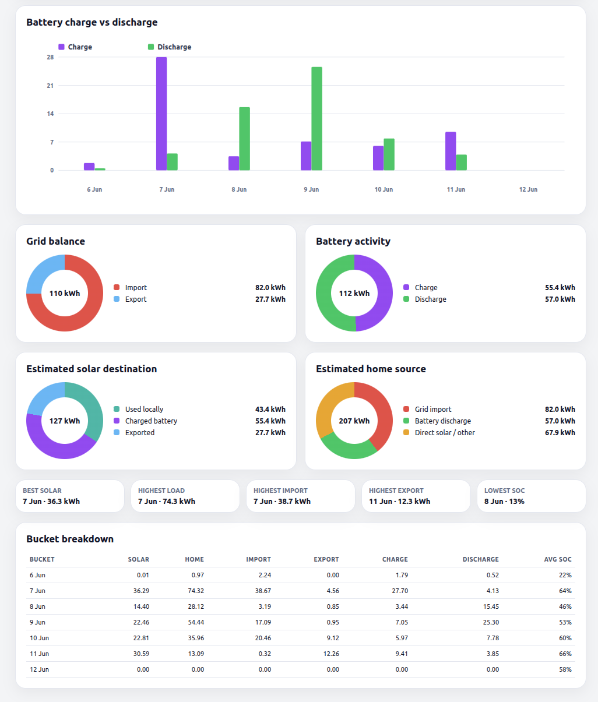

# Home Energy Manager

**Monitor and control your GivEnergy solar and battery system from your own computer — no cloud account needed.**

Home Energy Manager connects directly to your inverter over your home network and shows you live data in real time. You can check your solar generation, battery charge, and energy costs, set charge schedules, and automate your battery — all without sending any data to the internet.


> 🙏 **Huge thanks to the open-source projects that made this possible:**
> [**GivTCP**](https://github.com/GivEnergy/giv_tcp) and [**givenergy-modbus**](https://github.com/dewet22/givenergy-modbus) — the community-driven GivEnergy protocol references that this app builds on.

<div align="center">

<a href="https://www.buymeacoffee.com/psylsph" target="_blank"></a>

</div>

## Screenshots

<table>
  <tr>
    <td align="center"><b>Status Dashboard</b><br></td>
    <td align="center"><b>Status — Mobile</b><br></td>
  </tr>
  <tr>
    <td align="center"><b>Power Chart</b><br></td>
    <td align="center"><b>Battery Detail</b><br></td>
  </tr>
    <tr>
    <td align="center"><b>Inverter Info</b><br></td>
    <td align="center"><b>Meters</b><br></td>
  </tr>

  <tr>
    <td align="center"><b>Energy History</b><br></td>
    <td align="center"><b>History — Solar</b><br></td>
  </tr>
  <tr>
    <td align="center"><b>History — Home</b><br></td>
</tr>

  <tr>
    <td align="center"><b>Control Panel</b><br></td>
    <td align="center"><b>Settings</b><br></td>
  </tr>
  <tr>
    <td align="center"><b>Developer Console</b><br></td>
    <td align="center"><b>Consumption Reports</b><br></td>
  </tr>
  <tr>
    <td align="center"><b>Consumption Report (PDF)</b><br></td>
    <td></td>
  </tr>
</table>

---

## 🚀 Getting Started

### 1. Download and install

Go to the [**Releases page**](https://github.com/psylsph/home-energy-manager/releases/latest) and download the file for your system:

| Your computer | Download the file ending in |
|---|---|
| 🪟 **Windows** | `.msi` |
| 🍎 **Mac with Apple Silicon** (M1/M2/M3/M4) | `.dmg` with `aarch64` in the name |
| 🍎 **Mac with Intel processor** | `.dmg` with `x64` in the name |
| 🐧 **Linux** (Ubuntu, Debian, etc.) | `.deb` |
| 🐧 **Linux** (Fedora, openSUSE, etc.) | `.rpm` |
| 🍓 **Raspberry Pi** (64-bit OS only) | `.deb` with `arm64` in the name |

**Windows users** — Windows may show "Windows protected your PC" / SmartScreen when you try to run the `.msi`. This is because the app isn't code-signed (code signing certificates cost hundreds per year). It's safe — it's open-source software you can inspect on GitHub. To run it:

1. Click **"More info"** on the SmartScreen screen
2. Click **"Run anyway"**

If the installer itself won't open, right-click the `.msi` → **Properties** → check the **"Unblock"** box → **OK**, then run it again.

**Mac users** — after opening the `.dmg`, drag the app to your **Desktop** or **Home folder** (not `/Applications`). On first launch, right-click the app → **Open** → **Open** to bypass Gatekeeper. See the [FAQ](./FAQ.md) if you get stuck.

**Linux users** — you may need to install two system libraries first. See [INSTALL.md](./INSTALL.md#linux-system-requirements) for details.

### 2. Find your inverter's IP address

The app needs the IP address of the small WiFi or Ethernet dongle connected to your inverter. You can find this in your router's device list — look for a device named "GivEnergy" or check the MAC address printed on the dongle.

Not sure? Don't worry — the app can find it for you (see step 4 below).

### 3. Connect

1. Open the app and go to **Settings** (the ⚙️ icon at the bottom)
2. Enter your inverter's IP address in the **Host** field
3. Click **Connect**

Live data should appear on the Status page within a few seconds. The serial number is detected automatically.

### 4. Can't find the IP? Let the app scan for you

Click **Scan Network** on the Settings page. The app will search your local network for GivEnergy data adapters and list any it finds. Click on one to auto-fill the IP address.

> **Tip**: If the connection keeps dropping or data looks wrong, try a wired Ethernet connection between your data adapter and router. The WiFi dongles can be unreliable.

---

## Features

Home Energy Manager connects directly to your inverter over your home network. It never sends data to the internet and doesn't need a GivEnergy Cloud account.

### Monitoring

- **Real-time dashboard** — see solar generation, battery charge level, grid import/export, and home consumption updating live
- **Energy flow diagram** — animated visual showing where your power is flowing right now (solar → battery → home → grid)
- **Power chart** — live chart tracking solar, battery, grid, and home power with selectable time ranges from 15 minutes to 7 days. Click legend labels to show or hide individual lines.
- **Battery detail** — individual cell voltages, temperatures, and health per battery module
- **Solar page** — voltage, current, and power for each solar string (supports dual-string systems)
- **Inverter page** — model name, firmware versions, serial number, temperatures, and all electrical readings at a glance
- **Meters page** — external meter readings with per-phase voltage, current, and power, plus a CT clamp status card
- **Cold battery warning** — alerts you when your battery temperature drops near freezing so you can protect it

### History & Cost Tracking

- **Time-range charts** — 7 selectable ranges from 15 minutes to 7 days, covering solar, battery, grid, and home energy
- **Energy breakdown views** — separate charts for solar, home, grid, and battery with shared time-range selection
- **Month calendar view** — daily energy totals at a glance for the whole month
- **Cost tracking** — enter your import and export tariffs to see running cost estimates on your charts
- **CSV export** — download your energy history as a spreadsheet
- **PDF consumption reports** — generate formatted A4 PDF reports with charts and summary tables for each energy metric (solar, home, grid, battery). Includes min/max/average values and cost breakdowns. One click from the History page.
- **Consumption Reports** — summary statistics for any time range including total energy, peak power, solar coverage percentage, and grid dependency, with time-bucketed breakdowns exportable as CSV

### Control

- **Charge & discharge schedules** — set time slots for when your battery charges from the grid or discharges to power your home (up to **10 slots** on supported models)
- **Battery modes** — switch between Eco (automatic self-consumption), Timed Discharge, and Pause
- **Force Charge / Force Discharge** — one-click buttons for instant manual control (click to start, click again to stop)
- **SOC control** — adjust battery reserve level, charge/discharge power limits, and charge target
- **Battery calibration** — start calibration from the app when your battery needs it (auto-detected)
- **Load Discharge Limiter** — cap battery discharge during high-demand periods with a configurable power threshold and time window

### Automation

- **Octopus Cosy** (beta) — enter your three Cosy cheap-rate windows and the app automatically charges your battery during each one, switching back to Eco mode in between. Survives an app restart mid-slot.
- **Octopus Agile** (beta) — enter your postcode and price thresholds. The app charges when Agile prices are low, discharges when they're high, and stays in Eco the rest of the time. Includes a live 24-hour price forecast grid with daily savings estimates.
- **Auto Winter Mode** — protects your battery from cold by automatically charging it from the grid when the temperature drops. You set the temperature threshold and target charge level. Works the same way as GivEnergy Cloud's winter mode, but runs entirely on your own machine.

### Compatibility

- **Works with every GivEnergy inverter model** — Gen 1, Gen 2, Gen 3, Gen 4, Three Phase, AC Three Phase, HV Gen 3, All-in-One, AIO Hybrid, and AIO Commercial
- **Three-phase and commercial systems** — fully supported, including the GIV-3HY family and All-in-One units
- **Smart meter detection** — handles LoRA-linked meters and slow-responding CT clamps so nothing gets missed at startup

---

## Supported Inverters

Home Energy Manager works with all known GivEnergy inverter models. Real-time monitoring, Force Charge/Discharge, Cosy and Agile automation, and Auto Winter Mode work on every model. The main difference between models is how many charge/discharge schedule slots you can set:

### 10-slot schedules ✅

*Full control — live data, up to 10 charge + 10 discharge slots, all limits and modes*

| Model | Notes |
|---|---|
| **Gen 3 Hybrid** (5kW/8kW/10kW) | Most common. Extended 10-slot schedules require ARM firmware ≥ 303. |
| **Gen 4 Hybrid** | Latest generation |
| **Three Phase** (e.g. GIV-3HY-11 11kW) | Full three-phase support |
| **AC Three Phase** | AC-coupled three-phase |
| **HV Gen 3** | High-voltage hybrid |
| **All-in-One** (3.6kW/5kW/6kW) | Commercial all-in-one units |
| **All-in-One Hybrid** | Combined hybrid + AIO |
| **AIO Commercial** | Commercial three-phase variant |

### 2-slot schedules ✅

*Full control with the simpler 2-slot layout*

| Model | Notes |
|---|---|
| **Gen 2 Hybrid** | Standard home hybrid inverter |
| **Gen 3 Plus Hybrid** / **Polar Hybrid** | Newer single-phase variants |
| **PV Inverter** (no battery) | Solar-only — battery controls are hidden |

### 1-slot schedules ✅

*Live data, power limits, SOC, and modes — but only one charge + one discharge slot*

| Model | Notes |
|---|---|
| **Gen 1 Hybrid** | Older generation |
| **AC Coupled** (standard & Mk2) | Retrofit battery system |

> **Not sure which model you have?** Just connect the app to your inverter and check the Inverter tab — it shows the detected model name and details automatically.

---

## Supported Platforms

| Platform | Available as |
|---|---|
| Windows | `.msi` installer |
| macOS (Apple Silicon & Intel) | `.dmg` |
| Linux (x86_64) | `.deb` and `.rpm` packages |
| Raspberry Pi (64-bit OS) | `.deb` (ARM64) |
| Any device with a browser | Access the web UI at `http://your-pi-ip:7337` when running headless |

The app also runs as a **headless server** — a background service with no window, serving the full UI to any browser on your network. Great for Raspberry Pi or an always-on server. See [INSTALL.md](./INSTALL.md) for setup instructions.

---

## 📱 Using on Your Phone Away From Home

Home Energy Manager has a built-in web server, so you can access it from your phone's browser. Combined with [**Tailscale**](https://tailscale.com) (a free, zero-config VPN), you can check your system from anywhere — no cloud dependency, no port forwarding, no static IP.

### Setup

1. **Install Tailscale** on the machine running Home Energy Manager and on your phone
2. Both devices join the same Tailscale network
3. Open your phone browser to `http://<tailscale-ip>:7337`
4. Tap **Share → Add to Home Screen** for an app-like icon

Tailscale encrypts everything end-to-end, so your inverter data stays private.

<details>
<summary><b>📋 Detailed instructions</b></summary>

Install Tailscale on your server machine:

```bash
curl -fsSL https://tailscale.com/install.sh | sh
sudo tailscale up
# Note the Tailscale IP shown (or find it later with: tailscale ip -4)
```

Then on your phone:

1. Install the **Tailscale** app from the App Store / Play Store
2. Log in to the same account — your devices appear automatically
3. Open Safari / Chrome and go to `http://<tailscale-ip>:7337`
4. Tap **Share → Add to Home Screen** for a native-app-like experience

> 💡 **Tip**: Set Home Energy Manager to run on boot so it's always available.

</details>

<details>
<summary><b>🔧 Alternative: Tailscale Funnel (no app needed on phone)</b></summary>

If you don't want Tailscale on your phone, you can expose the web UI via a public `.ts.net` URL:

```bash
sudo tailscale serve --bg --https 443 127.0.0.1:7337
sudo tailscale funnel --bg 443
```

Your app will be available at `https://<machine-name>.<tailnet-name>.ts.net`. Tailscale handles HTTPS. Note: Funnel is a paid Tailscale feature.

</details>

### Compared to the cloud portal

| | Cloud portal | Home Energy Manager + Tailscale |
|---|---|---|
| **Speed** | 1–3 second delay | Real-time |
| **Internet needed?** | Always | Only when away from home |
| **Cloud dependency** | Depends on GivEnergy servers | None |
| **Privacy** | Data via GivEnergy | End-to-end encrypted |
| **Cost** | Free | Free |

---

## About the Name Change

This project was originally called **GivEnergy-Local**. The user-facing name is now **Home Energy Manager**, but the internal executable is still called `givenergy-local` and your settings and history are stored in the same place (`~/.givenergy-local`). Upgrading is seamless — everything carries over.

---

## Credits

This project would not exist without the pioneering reverse-engineering work of the GivEnergy open-source community.

- **[GivTCP](https://github.com/GivEnergy/giv_tcp)** — the original GivEnergy Modbus integration for Home Assistant. This app builds on the protocol mapping and write methodology that GivTCP established.

- **[givenergy-modbus](https://github.com/dewet22/givenergy-modbus)** — the definitive Python reference library for the GivEnergy Modbus protocol. Its detailed register map and working reference implementation were invaluable.

Both projects are open-source and available on GitHub. If you find this app useful, consider giving them a star too ⭐

## License

MIT — see [LICENSE](./LICENSE).
